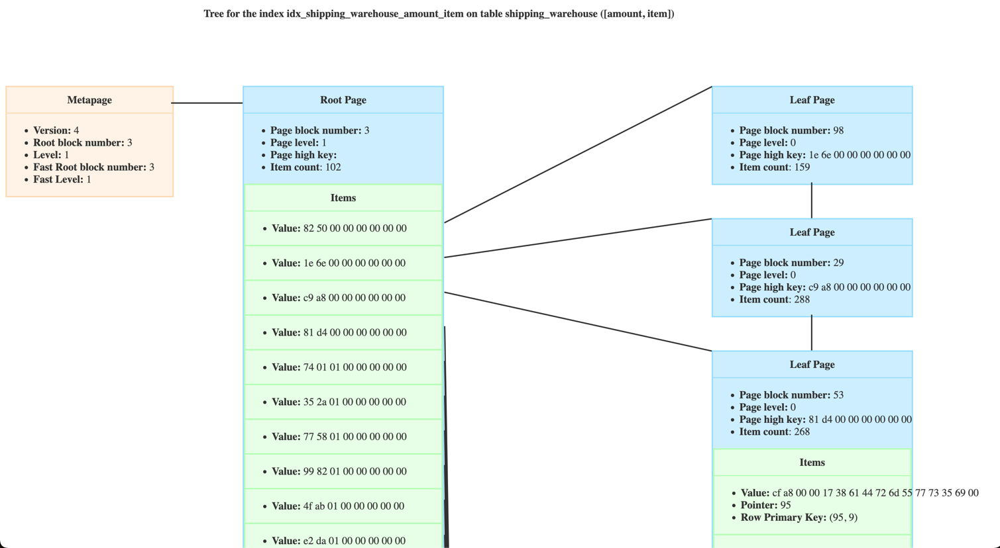

# Rust Postgres Index Inspector

This Rust tool is a port of the python tool -  [`pageinspect_inspector`](https://github.com/louiseGrandjonc/pageinspect_inspector) tool by [Louise Grandjonc](https://www.louisemeta.com/).
It allows you to inspect and analyze the internal structure of PostgreSQL indexes, highlighting page layout and tuples and in my opinion, it's a pretty cool project to work on :D

## Introduction

This tool currently only supports btree indexes. (Support GIN indexes planned later on). It leverages `handlebars` for visualization of the trees with minor tweaks from original 
python project.

Sample output of the tool:

## How to Use
1. Install [`pageinspect`](https://www.postgresql.org/docs/10/static/pageinspect.html) extension in your database.
2. Clone the repository and run ` cargo run --release -- -o <output-path-for-html> -i <index-name> -u <postgres-user>`
3. You can run `cargo run --release -- --help` for more flags.

## Caveats
1. The tool currently only supports btree indexes.
2. This tool's UI could use some bug fixes. (PRs are welcome)
3. With large indexes, the tool might take a while to generate the output (imagine ~1 min), and dynamic rendering of lines might break the UI.
